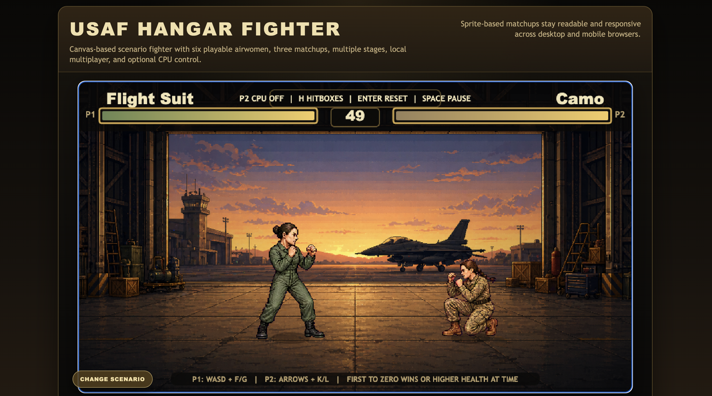
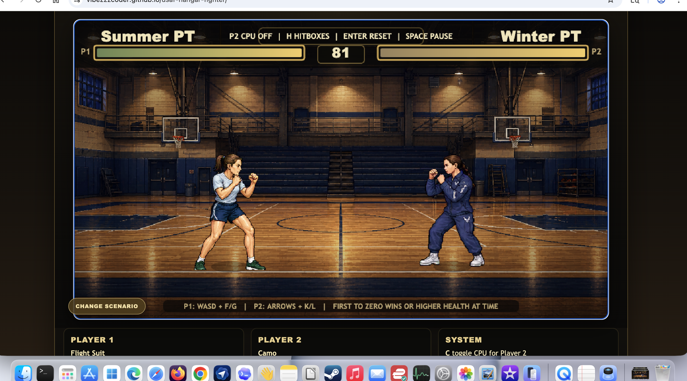
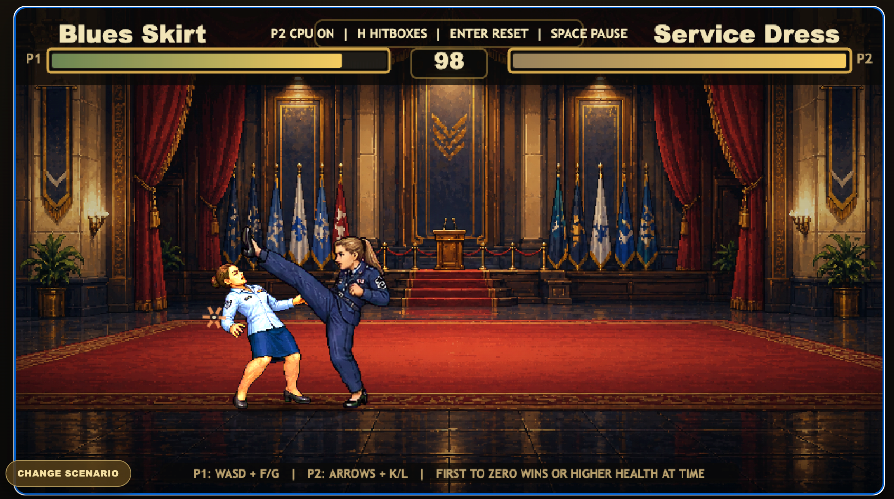

# USAF Hangar Fighter

A browser-based 2D arcade fighting game prototype with scenario-based matchups, desktop keyboard play, and mobile touch controls.

Play it here:

https://vibezzzcoder.github.io/usaf-hangar-fighter/

## Status

This is an early prototype. Gameplay, art, controls, and balance may change frequently.

## Screenshots

## Features

- Three scenarios: Joint Maintenance, PT Showdown, and Formal Face-Off
- Scenario-specific fighter pairings and stage backgrounds
- Local two-player keyboard controls
- Optional CPU control for Player 2
- Mobile touch controls for phone and tablet browsers
- Punch, kick, jump, crouch, hitstun, knockback, health bars, and win state
- Debug hitbox toggle for tuning and testing

## Controls

Player 1:

- `A` / `D` = move
- `W` = jump
- `S` = crouch
- `F` = punch
- `G` = kick
- `R` = block

Player 2:

- `Left` / `Right` = move
- `Up` = jump
- `Down` = crouch
- `K` = punch
- `L` = kick
- `O` = block

System:

- `C` = toggle CPU for Player 2
- `H` = toggle hitbox debug
- `Space` = pause
- `Enter` = reset

Mobile:

- Touch controls appear automatically.
- `JUMP LEFT` and `JUMP RIGHT` buttons provide mobile-friendly diagonal jumps.
- Portrait and landscape are both playable.
- Landscape gives the roomiest view when the browser supports it cleanly.
- For the best phone experience, use landscape and choose `Add to Home Screen` for fullscreen play.
- Player 2 CPU is enabled by default on phones/tablets.

## Local Play

Open `index.html` directly in a desktop browser, or host the repository with any static file server.

No build step is required for local play.

## Attribution

Created by [@VibezZzCoder](https://github.com/VibezZzCoder).

USAF Hangar Fighter is an independent fan/prototype project and is not an official U.S. Air Force product. It is not endorsed by, sponsored by, or affiliated with the U.S. Air Force, the Department of the Air Force, or the U.S. Department of Defense.

The project uses fictionalized, stylized, military-inspired characters and settings. No official endorsement is implied.

## Contributing

Issues, suggestions, and pull requests are welcome. Please keep contributions respectful and consistent with the project's fictional, unofficial nature.

## License

USAF Hangar Fighter is licensed under the GNU General Public License v3.0 or later.

Copyright (C) 2026 VibezZzCoder

This project is free software: you can redistribute it and/or modify it under the terms of the GNU General Public License as published by the Free Software Foundation, either version 3 of the License, or, at your option, any later version.

This project is distributed in the hope that it will be useful, but WITHOUT ANY WARRANTY; without even the implied warranty of MERCHANTABILITY or FITNESS FOR A PARTICULAR PURPOSE. See the GNU General Public License for more details.

The license applies to this project's original code and assets. It does not grant rights to use any third-party trademarks, logos, seals, emblems, or official marks.

The copyright notice applies to this independent fan/prototype project's original code and original assets only. It does not claim ownership of, endorsement by, or affiliation with the U.S. Air Force, the Department of the Air Force, or the U.S. Department of Defense.

See `LICENSE` for the full license text.
